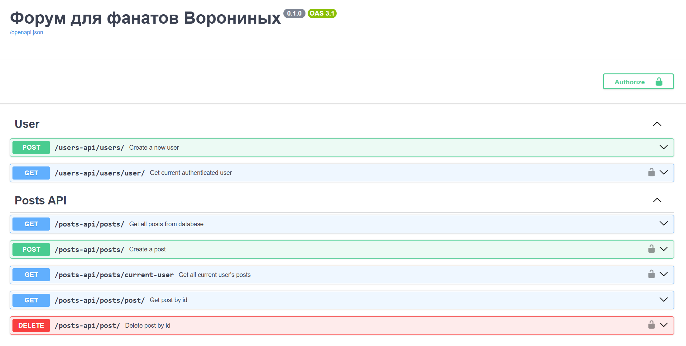

# voronini.fun - форум на FastAPI
___


## Описание проекта
___
### Backend часть форума для любителей сериала ворониных (и не только), где можно делиться своими постами и просматривать чужие.
### Концепция: авторизуясь на форуме, пользователь попадает на главную страницу, где его ждет лента рекомендаций с постами других пользователей. Там же он может поделиться своим.
___
### Что реализовано на данный момент: 
- user API: создание нового пользователя и получение информации о текущем **авторизованном** пользователе;
- posts API: создание, удаление, просмотр всех своих постов, просмотр всех постов на платформе, поиск поста по идентификатору;
- auth API: login и logout на сайте, реализовано через хранение сессий в **Cookies** и **Redis**.


## Запуск проекта с помощью **Docker**
___
### 1. Скачать и установить программу Docker на свой компьютер
### 2. Склонировать проект на свой компьютер, например через HTTPS
### 3. Открыть терминал и перейти в директорию ***Voronini-Fun-FastAPI-***
### 4. Выполнить в терминале следующие команды:
```shell
docker compose build --no-cache
```
```shell
docker compose up
```
### 5. Когда проект запустится, в адресную строку браузера ввести [`localhost:8000/docs`](): автоматическая OpenAPI-документация.

## Stack
___
### - Python 3.12
### - FastAPI
### - Alembic
### - SQLAlchemy 2.0 (async)
### - Poetry
### - Redis
### - PostgreSQL